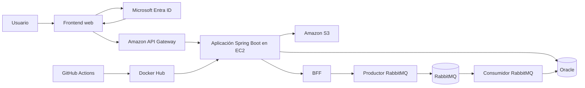

# Plataforma Educativa Cloud Native

Proyecto académico desarrollado para la Evaluación Final Transversal de la asignatura **Desarrollo Cloud Native** en Duoc UC.

La solución implementa una plataforma educativa desplegada en la nube, con autenticación mediante Microsoft Entra ID, control de acceso por roles, comunicación asíncrona con RabbitMQ, almacenamiento de archivos en Amazon S3, persistencia en Oracle, exposición de servicios mediante Amazon API Gateway y despliegue automatizado con GitHub Actions.

---

## Estado del proyecto

La implementación incluye:

- Backend desarrollado con Spring Boot.
- Frontend web integrado dentro de la aplicación.
- Autenticación del frontend y backend con Microsoft Entra ID.
- Usuarios internos de demostración separados para los roles `ESTUDIANTE` e `INSTRUCTOR`.
- Autorización por rol validada desde el frontend cloud con respuestas HTTP 200, 201 y 403.
- Persistencia de información académica en Oracle.
- Productor y consumidor de mensajes con RabbitMQ.
- BFF para procesar resúmenes de inscripciones.
- Gestión de archivos mediante Amazon S3.
- API publicada mediante Amazon API Gateway.
- Aplicación desplegada con Docker en Amazon EC2.
- Pipeline CI/CD mediante GitHub Actions.
- Pruebas automatizadas utilizando H2.

---

## Arquitectura de la solución



### Flujo principal

1. El usuario accede al frontend.
2. Microsoft Entra ID autentica al usuario y genera un token JWT.
3. El frontend envía el token en las solicitudes.
4. Amazon API Gateway valida el JWT.
5. Spring Security vuelve a validar el token y aplica los permisos por rol.
6. El backend procesa la operación solicitada.
7. Los datos se almacenan en Oracle, RabbitMQ o Amazon S3 según corresponda.

---

## Tecnologías utilizadas

### Backend

- Java 17
- Spring Boot
- Spring Web
- Spring Data JPA
- Spring Security
- OAuth 2.0 Resource Server
- Maven
- Oracle Database
- H2 para pruebas

### Frontend

- HTML5
- CSS3
- JavaScript
- Microsoft Authentication Library, MSAL
- Microsoft Entra ID

### Servicios cloud

- Amazon EC2
- Amazon API Gateway
- Amazon S3
- GitHub Actions
- Docker Hub
- Microsoft Entra ID
- Oracle Database

### Mensajería y contenedores

- RabbitMQ
- Docker
- Docker Compose

---

## URL pública

El frontend y los servicios de la aplicación están disponibles mediante Amazon API Gateway:

```text
https://uj04zxa1xh.execute-api.us-east-1.amazonaws.com/
```

La misma dirección funciona como base para las API:

```text
https://uj04zxa1xh.execute-api.us-east-1.amazonaws.com/api
```

La dirección de API Gateway debe utilizarse para las pruebas y demostraciones finales, evitando depender directamente de la IP pública de EC2.

---

## Autenticación y autorización

La plataforma utiliza Microsoft Entra ID como proveedor de identidad.

El frontend inicia sesión utilizando MSAL y solicita un token para el permiso delegado de la API. Posteriormente, el token se envía mediante el encabezado:

```http
Authorization: Bearer <token>
```

La API Gateway posee un autorizador JWT configurado con el emisor y la audiencia de Microsoft Entra ID.

Spring Security extrae los roles desde el atributo:

```text
roles
```

y los transforma en autoridades con el prefijo:

```text
ROLE_
```

### Usuarios demostrativos

Para validar la autenticación interactiva del frontend se configuraron dos usuarios internos dentro del tenant de Microsoft Entra ID:

| Usuario de demostración | Rol asignado | Validación principal |
|---|---|---|
| Estudiante Demo | `ESTUDIANTE` | Consulta servicios académicos y ejecuta el BFF; recibe `HTTP 403` al intentar crear contenidos. |
| Instructor Demo | `INSTRUCTOR` | Crea contenidos, consulta resultados y califica evaluaciones; recibe `HTTP 403` al intentar ejecutar el BFF. |

Las contraseñas y demás credenciales se administran de forma privada en Microsoft Entra ID y **no se almacenan en el repositorio ni en este README**. Para la evaluación se entregan por un canal separado.

---

## Roles y permisos

### ESTUDIANTE

El rol `ESTUDIANTE` puede:

- Consultar cursos.
- Consultar contenidos.
- Consultar evaluaciones.
- Crear inscripciones.
- Enviar respuestas de evaluaciones.
- Ejecutar el proceso BFF.
- Generar resúmenes.
- Descargar archivos almacenados en S3.

No puede:

- Crear o modificar cursos.
- Crear o modificar contenidos.
- Crear evaluaciones.
- Consultar resultados de otros estudiantes.
- Calificar evaluaciones.
- Administrar archivos en S3.

### INSTRUCTOR

El rol `INSTRUCTOR` puede:

- Consultar cursos.
- Crear cursos y consultar su información.
- Consultar contenidos.
- Crear, modificar y eliminar contenidos.
- Crear y administrar evaluaciones.
- Consultar respuestas enviadas.
- Calificar evaluaciones.
- Asignar notas y retroalimentación.
- Subir, reemplazar y eliminar archivos en Amazon S3.

No puede ejecutar el BFF reservado para estudiantes.

### Validación funcional de autorización

| Usuario | Operación desde el frontend cloud | Resultado esperado y obtenido |
|---|---|---|
| Estudiante Demo | Crear contenido | `HTTP 403 Forbidden` |
| Estudiante Demo | Procesar resumen mediante BFF | `HTTP 200 OK` |
| Instructor Demo | Crear contenido | `HTTP 201 Created` |
| Instructor Demo | Procesar resumen mediante BFF | `HTTP 403 Forbidden` |
| Instructor Demo | Consultar resultados | `HTTP 200 OK` |
| Instructor Demo | Calificar resultado | `HTTP 200 OK` |

Estas pruebas confirman que el rol incluido en el token JWT es validado tanto por Amazon API Gateway como por Spring Security.

---

## Endpoints principales

La URL base local es:

```text
http://localhost:8080
```

La URL base cloud es:

```text
https://uj04zxa1xh.execute-api.us-east-1.amazonaws.com
```

### Cursos

| Método | Endpoint | Rol |
|---|---|---|
| GET | `/api/cursos` | ESTUDIANTE / INSTRUCTOR |
| GET | `/api/cursos/{id}` | ESTUDIANTE / INSTRUCTOR |
| POST | `/api/cursos` | INSTRUCTOR |

### Inscripciones

| Método | Endpoint | Rol |
|---|---|---|
| POST | `/api/inscripciones` | ESTUDIANTE |

### Contenidos

| Método | Endpoint | Rol |
|---|---|---|
| GET | `/api/contenidos/curso/{idCurso}` | ESTUDIANTE / INSTRUCTOR |
| POST | `/api/contenidos/curso/{idCurso}` | INSTRUCTOR |
| PUT | `/api/contenidos/{idContenido}` | INSTRUCTOR |
| DELETE | `/api/contenidos/{idContenido}` | INSTRUCTOR |

### Evaluaciones

| Método | Endpoint | Rol |
|---|---|---|
| GET | `/api/evaluaciones/curso/{idCurso}` | ESTUDIANTE / INSTRUCTOR |
| POST | `/api/evaluaciones/curso/{idCurso}` | INSTRUCTOR |
| POST | `/api/evaluaciones/{idEvaluacion}/respuestas` | ESTUDIANTE |
| GET | `/api/evaluaciones/{idEvaluacion}/resultados` | INSTRUCTOR |
| PUT | `/api/evaluaciones/{idEvaluacion}` | INSTRUCTOR |
| DELETE | `/api/evaluaciones/{idEvaluacion}` | INSTRUCTOR |
| PUT | `/api/evaluaciones/resultados/{idResultado}/calificar` | INSTRUCTOR |

### BFF

| Método | Endpoint | Rol |
|---|---|---|
| POST | `/api/bff/inscripciones/{idInscripcion}/procesar-resumen` | ESTUDIANTE |

El BFF realiza el flujo:

```text
Consultar inscripción
→ producir mensaje
→ enviar a RabbitMQ
→ consumir mensaje
→ almacenar resultado en Oracle
```

### RabbitMQ

| Método | Endpoint | Descripción |
|---|---|---|
| POST | `/api/resumenes-mq/{idInscripcion}/enviar-cola` | Envía un resumen a RabbitMQ |
| POST | `/api/resumenes-mq/consumir-guardar` | Consume y almacena el mensaje |
| GET | `/api/resumenes-mq/guardados` | Consulta mensajes procesados |

Configuración principal:

```text
Cola: resumen.inscripcion.queue
Exchange: resumen.inscripcion.exchange
Routing key: resumen.inscripcion.routing
```

### Amazon S3

| Método | Endpoint | Rol |
|---|---|---|
| GET | `/api/resumenes/{idInscripcion}/generar` | ESTUDIANTE / INSTRUCTOR |
| POST | `/api/resumenes/{idInscripcion}/subir` | INSTRUCTOR |
| GET | `/api/resumenes/{idInscripcion}/descargar/{nombreArchivo}` | ESTUDIANTE / INSTRUCTOR |
| PUT | `/api/resumenes/{idInscripcion}/reemplazar` | INSTRUCTOR |
| DELETE | `/api/resumenes/{idInscripcion}/eliminar/{nombreArchivo}` | INSTRUCTOR |

Los archivos se almacenan con una estructura similar a:

```text
resumenes/{idInscripcion}/{nombreArchivo}
```

---

## Frontend

El frontend se encuentra en:

```text
src/main/resources/static/index.html
```

Spring Boot lo publica automáticamente en:

```text
http://localhost:8080/
```

En la nube se accede mediante:

```text
https://uj04zxa1xh.execute-api.us-east-1.amazonaws.com/
```

La interfaz permite:

- Iniciar y cerrar sesión con Microsoft Entra ID.
- Mostrar el usuario autenticado.
- Mostrar el rol obtenido desde el token.
- Consultar cursos.
- Consultar contenidos.
- Consultar evaluaciones.
- Crear contenido de prueba con el rol `INSTRUCTOR`.
- Consultar resultados de evaluaciones.
- Calificar un resultado desde el frontend con nota y retroalimentación.
- Ejecutar el BFF con el rol `ESTUDIANTE`.
- Mostrar respuestas HTTP exitosas o denegadas para comparar permisos (`200`, `201` y `403`).

---

## Ejecución local

### Requisitos

- Java 17
- Docker Desktop
- Maven Wrapper incluido en el proyecto
- Acceso a Oracle
- Aplicación registrada en Microsoft Entra ID
- Credenciales temporales de AWS cuando se utilice S3

### 1. Iniciar RabbitMQ

Desde la raíz del proyecto:

```bash
docker compose up -d
```

La consola de administración queda disponible en:

```text
http://localhost:15672
```

### 2. Configurar la aplicación

Revisar la configuración de:

```text
src/main/resources/application.properties
```

La aplicación necesita información para:

- Oracle.
- Microsoft Entra ID.
- Amazon S3.
- RabbitMQ.
- URL interna utilizada por el BFF.

No se deben almacenar nuevas credenciales personales directamente en el repositorio.

### 3. Ejecutar en Windows

```powershell
.\mvnw.cmd spring-boot:run
```

### 4. Ejecutar en Linux o macOS

```bash
./mvnw spring-boot:run
```  

### 5. Abrir el frontend

```text
http://localhost:8080/
```

---

## Pruebas automatizadas

Las pruebas utilizan el perfil:

```text
test
```

y una base de datos H2 en memoria con compatibilidad para Oracle.

Archivo de configuración:

```text
src/main/resources/application-test.properties
```

Ejecutar las pruebas en Windows:

```powershell
.\mvnw.cmd clean test
```

Ejecutar las pruebas en Linux:

```bash
./mvnw clean test
```

Resultado esperado:

```text
Tests run: 1, Failures: 0, Errors: 0
BUILD SUCCESS
```

La prueba actual valida que el contexto de Spring Boot pueda iniciar correctamente sin depender de una conexión externa a Oracle.

---

## Docker

### Construcción de la imagen

```bash
docker build -t plataformaeducativa .
```

### Ejecución local

```bash
docker run --name plataformaeducativa -p 8080:8080 plataformaeducativa
```

Imagen publicada por el pipeline:

```text
frankcoral/plataformaeducativa:latest
```

---

## Despliegue en Amazon EC2

La aplicación y RabbitMQ se ejecutan en contenedores Docker dentro de EC2.

Contenedores esperados:

```text
plataformaeducativa
rabbitmq-plataformaeducativa
```

Comando de verificación:

```bash
sudo docker ps --format "table {{.Names}}\t{{.Image}}\t{{.Status}}\t{{.Ports}}"
```

Verificación de las colas:

```bash
sudo docker exec rabbitmq-plataformaeducativa \
rabbitmqctl list_queues \
name messages_ready messages_unacknowledged consumers
```

---

## Amazon API Gateway

La API utiliza una etapa:

```text
$default
```

con implementación automática habilitada.

Rutas principales:

```text
GET /
ANY /{proxy+}
```

### Ruta pública del frontend

```text
GET /
```

Esta ruta no utiliza autorizador, porque la página debe cargarse antes de iniciar sesión.

### Ruta proxy de servicios

```text
ANY /{proxy+}
```

Esta ruta utiliza el autorizador JWT de Microsoft Entra ID y reenvía los endpoints hacia la aplicación desplegada en EC2.

---

## Pipeline CI/CD

El workflow se encuentra en:

```text
.github/workflows/deploy.yml
```

El pipeline se ejecuta automáticamente con cada `push` a la rama:

```text
main
```

Etapas del pipeline:

1. Descarga del código fuente.
2. Configuración de Java 17.
3. Inicio de RabbitMQ como servicio de pruebas.
4. Ejecución de pruebas automatizadas.
5. Inicio de sesión en Docker Hub.
6. Construcción de la imagen Docker.
7. Publicación de la imagen.
8. Conexión SSH con Amazon EC2.
9. Despliegue de RabbitMQ.
10. Despliegue de la aplicación.
11. Verificación de los contenedores activos.

### Secrets requeridos

El repositorio utiliza los siguientes secrets de GitHub Actions:

```text
AWS_ACCESS_KEY_ID
AWS_SECRET_ACCESS_KEY
AWS_SESSION_TOKEN
DOCKERHUB_USERNAME
DOCKERHUB_TOKEN
EC2_HOST
EC2_USER
EC2_SSH_KEY
```

Los valores de estos secrets no deben publicarse en el repositorio.

---

## Scripts Oracle

El respaldo SQL se encuentra en:

```text
scripts/oracle/01_modulos_academicos.sql
```

El script incluye:

- Secuencias.
- Tabla de contenidos.
- Tabla de evaluaciones.
- Tabla de resultados.
- Claves primarias.
- Claves foráneas.
- Restricciones.
- Índices.

El archivo funciona como respaldo de la estructura de datos. No debe ejecutarse sobre una base que ya tenga los objetos creados por Hibernate sin comprobar previamente su existencia.

---

## Estructura principal

```text
plataformaeducativa
├── .github
│   └── workflows
│       └── deploy.yml
├── scripts
│   └── oracle
│       └── 01_modulos_academicos.sql
├── src
│   ├── main
│   │   ├── java
│   │   │   └── cl.duoc.plataformaeducativa
│   │   └── resources
│   │       ├── static
│   │       │   └── index.html
│   │       ├── application-test.properties
│   │       └── application.properties
│   └── test
│       └── java
│           └── cl.duoc.plataformaeducativa
├── Dockerfile
├── docker-compose.yml
├── mvnw
├── mvnw.cmd
├── pom.xml
└── README.md
```

---

## Evidencias funcionales realizadas

Durante la validación se comprobaron los siguientes escenarios:

- Creación de usuarios internos de demostración en Microsoft Entra ID.
- Asignación independiente de los roles `ESTUDIANTE` e `INSTRUCTOR`.
- Inicio de sesión del usuario Estudiante Demo desde el frontend cloud.
- Inicio de sesión del usuario Instructor Demo desde el frontend cloud.
- Reconocimiento de ambos roles desde los tokens JWT.
- Creación de contenido denegada al Estudiante Demo con `HTTP 403`.
- Creación de contenido autorizada al Instructor Demo con `HTTP 201`.
- Ejecución del BFF autorizada al Estudiante Demo con `HTTP 200`.
- Ejecución del BFF denegada al Instructor Demo con `HTTP 403`.
- Consulta de resultados autorizada al Instructor Demo con `HTTP 200`.
- Calificación de evaluación realizada desde el frontend por Instructor Demo con `HTTP 200`.
- Consulta de cursos y contenidos desde el frontend.
- Creación de cursos con el rol `INSTRUCTOR`.
- Denegación de creación de cursos para `ESTUDIANTE`.
- Creación y consulta de contenidos.
- Denegación de administración de contenidos para `ESTUDIANTE`.
- Creación de evaluaciones.
- Envío de respuestas por estudiantes.
- Consulta y calificación por instructores.
- Denegación de calificación para estudiantes.
- Procesamiento del BFF.
- Producción y consumo de mensajes RabbitMQ.
- Persistencia de mensajes en Oracle.
- Generación de archivos.
- Carga, descarga y reemplazo de archivos en S3.
- Consulta de servicios mediante API Gateway.
- Despliegue inicial exitoso mediante GitHub Actions.
- Nuevo despliegue CI/CD exitoso después de incorporar la calificación desde el frontend.
- Ejecución exitosa de pruebas con H2.
- Frontend operativo desde la URL cloud.

---

## Seguridad

La solución implementa seguridad en diferentes niveles:

1. Microsoft Entra ID autentica a los usuarios.
2. API Gateway valida la firma, emisor y audiencia del JWT.
3. Spring Security valida nuevamente el token.
4. Los roles controlan el acceso a cada endpoint.
5. GitHub Secrets protege las credenciales del pipeline.
6. El frontend no almacena secretos de cliente.
7. MSAL utiliza un flujo adecuado para aplicaciones SPA.

---

## Autor

**Frank Córdoba**

Estudiante de Analista Programador Computacional  
Instituto Profesional Duoc UC

Proyecto desarrollado para la asignatura:

```text
Desarrollo Cloud Native
```